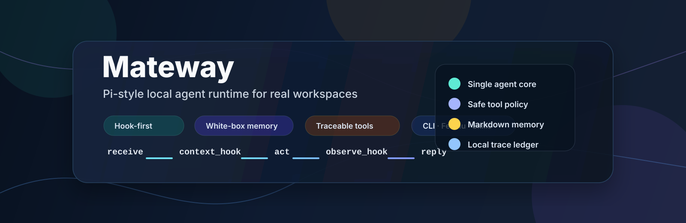

# Mateway
<p align="center">
  
</p>

**Mateway is a local-first Agent Runtime designed for real workspaces.**

It is not a heavyweight workflow platform, nor just a demo Agent for showcase. Mateway aims to transform large language models (LLMs) into "trusted executors" that can operate long-term within local projects, team instant messaging (IM) systems, file systems, toolchains, and task contexts.

> **In a nutshell: Mateway = Single Agent Main Loop + Hook-based Extension + Tool Security Boundaries + White-box Memory + Trace Observability.**

```text
receive -> context_hook -> model/tool loop -> tool_policy_hook
        -> observe_hook -> response_hook -> reply
```

## Why Mateway?
Many Agent projects impress in their first demo but face critical issues when integrated into daily work:

- **Powerful but uncontrollable**: Lack of clear boundaries for tool invocation, file writing, and terminal command execution.
- **Convenient but untrustworthy memory**: Long-term memory origins are opaque, and modification, rollback, or audit are difficult.
- **Fragmented runtimes across frontends**: CLI, IM, scheduled tasks, and script entrypoints operate independently with inconsistent behaviors.
- **Bulky frameworks with slow deployment**: Complex platforms are built before solving real-world tasks.
- **Non-reproducible execution**: Hard to track *why* a task was executed a certain way, *which* tools were used, or *where* time was spent.

Mateway takes the opposite approach:

> First, build a clean, transparent, and extensible closed-loop for a single Agent's execution; then let capabilities naturally emerge through hooks, skills, tools, and memory.

## Core Features

### 1. Pi-style, Optimized for Local Workspaces
Mateway draws inspiration from Pi Agent's runtime philosophy: instead of hardcoding all capabilities into a monolithic Agent, it centers on a stable main loop with well-defined extension points.

Mateway adheres to these principles today:
- Prioritize a single Agent main thread
- Avoid rushing into supervisor/sub-agent routing
- Do not force memory into the main loop
- Prevent premature bloat of the connector ecosystem
- Unify tools, skills, hooks, and traces under a single runtime protocol

This makes it ideal for individuals and small teams to deploy first, then scale gradually.

---

### 2. Hook-first Runtime
The new core of Mateway is a hook-based runtime:

```text
receive
  -> context_hook
  -> model/tool loop
  -> tool_policy_hook
  -> observe_hook
  -> response_hook
  -> reply
```

Each hook has a clear responsibility:

| Hook | Purpose |
|---|---|
| `context_hook` | Inject workspace profiles, user/tool summaries, lightweight memory refs, and real-time policies |
| `tool_policy_hook` | Unified handling of tool risks, path policies, dangerous commands, and confirmation boundaries |
| `observe_hook` | Write traces, task steps, acceptance evidence, and candidates for future memory proposals |
| `response_hook` | Sanitize final responses to adapt to different channels (CLI/Feishu, etc.) |
| `followup_hook` | Handle context continuation (e.g., "continue", "retry", "What about Tianjin?") |

The value of hooks: **Enhance capabilities without polluting the main loop; centralize security policies; avoid runtime fragmentation during future expansion.**

---

### 3. One Runtime, Multiple Entrypoints
Mateway is not limited to CLI or chatbots—**the same Agent runtime integrates with**:

- CLI: `mateway ask`
- Real task testing: `mateway test`
- Trace review: `mateway trace`
- Feishu WebSocket Gateway
- Future schedule/heartbeat/workspace UI

This means: **Capabilities validated in the terminal can be seamlessly ported to Feishu, scheduled tasks, and automation scenarios.**

---

### 4. Boundaries for Tool Usage
Mateway allows Agents to use real tools without fully ceding control to the model.

Current built-in tool categories:
- `file.read`
- `file.write`
- `project.index`
- `terminal.run`
- `web.search`
- `web.fetch`
- Future integration: `memory.search`
- Future integration: `schedule.*`

Security principles:
- File read/write operations are constrained by workspace path policies
- File writing, patching, and dangerous shell commands require confirmation
- Model-declared `confirmed=true` is not trusted
- Large files, binary files, and dangerous commands are guarded
- Final Feishu responses are sanitized to prevent leakage of tool protocol blocks

Mateway’s goal is not to let Agents "do everything"—but to let them operate within understandable, confirmable, and reproducible boundaries.

---

### 5. White-box Memory (No Black-boxes)
Mateway’s long-term memory is not an opaque blob of embeddings or auto-generated chat summaries.

The new memory design adheres to:

```text
task/trace/source evidence
  -> memory proposal
  -> user review
  -> commit / reject
  -> searchable Markdown memory
```

Memory directories use Markdown as the source of truth:

```text
~/.mateway/workspace/
  agents/
    main/
      memory.md                 # Prompt-facing short summary
  memory/
    user/
      long/
      inbox/
    org/
      long/
      inbox/
    agents/
      main/
        memory.md               # Long-term memory entry
        long/
        inbox/
        diary/
```

Core principles:
- Auto-generated content first enters `inbox/` or `diary/`
- No automatic commits to long-term memory
- Facts must include source evidence
- `index.json`, SQLite, and embeddings are only rebuildable indexes
- Markdown remains the readable, editable, and auditable source of truth

---

### 6. Trace-first Observability
Mateway treats Agent execution as a first-class citizen.

Each task is recorded as a JSONL trace, including:
- Request
- Model events
- Tool calls
- Tool results
- Pending confirmations
- Replies
- Runtime timing

Use this command to analyze traces:
```bash
mateway trace <trace-jsonl-path>
```

Quickly identify:
- Model latency
- Tool latency
- Runtime latency
- Feishu response latency
- Failed or suspicious steps

This is far more valuable for debugging Agents than just "checking the final answer."

---

## What It Can Do Today
Mateway has achieved a complete first-version closed loop:
- CLI task entrypoint
- Feishu WebSocket Gateway
- LaunchAgent gateway (serve/start/restart/stop/status)
- Single-instance locking
- Task trees
- Follow-up context continuation
- Pending confirmations
- JSONL trace logging
- Basic file/project/terminal/web tools
- Model fallback
- Workspace profile/tool/skill summary injection
- First-version skills discovery
- Real task test entrypoint: `mateway test`

Tasks ready for immediate testing:
```bash
mateway ask "Read README.md and summarize the project architecture."

mateway ask "Inspect the current project directory structure and identify the runtime entrypoint."

mateway test --message "Search for today's latest AI news and provide 5 high-value summaries."

mateway test --message "Review internal/tool/builtin.go and highlight risks and untested points."
```

---

## Capabilities Not Yet Completed (No False Claims)
Mateway is evolving rapidly. These features are designed but **not fully implemented** (and will not be misrepresented in this README):
- Complete memory write/proposal/commit/reject workflow
- `memory.search` safe-read tool
- Automated heartbeat maintenance
- User-explicit schedule runners
- Connector framework for mail/SSH/GitHub/social media publishing
- OS-level sandboxing
- Visual workspace UI
- Multi-Agent supervisor/sub-agent routing

Current strategy:
> Stabilize the single Agent Runtime first, then integrate memory, schedule, connectors, and visualization into the hook/trace system.

---

## Differentiation from Other Agent Frameworks

| Aspect | Common Agent Frameworks | Mateway |
|---|---|---|
| Core Goal | Rapid orchestration of complex Agent workflows | Reliable operation of a single Agent in real workspaces |
| Architecture Bias | Multi-Agent / workflow / graph | Single Agent main loop + hooks |
| Memory | Auto-summaries or black-box vector databases | Markdown-first, proposal-based, auditable |
| Tools | "Anything goes" invocation | Tool contracts + risk boundaries + confirmation |
| Observability | Focus on final results | Traces / task steps / evidence as first-class citizens |
| Frontends | Fragmented (CLI/chat/automation separate) | Unified runtime for CLI/Feishu/test/schedule |
| Extension | Plugins or platform-centric | Skills + tools + hooks + external scripts |

---

## Quick Start

### Build
```bash
git clone https://github.com/dragon123960-collab/mateway.git
cd mateway

go test ./...
go build -o build/mateway ./cmd/mateway
```

### Init
```bash
./build/mateway init
```

Initialization creates this structure:
```text
~/.mateway/
  config/
  workspace/
    agents/
    skills/
    memory/
  sessions/
  trace/
  run/
```

### Configure
```bash
cp ~/.mateway/config/mateway.env.sample ~/.mateway/config/mateway.env
vim ~/.mateway/config/mateway.env
vim ~/.mateway/config/config.yaml
```

Validate configuration:
```bash
./build/mateway doctor
```

### Ask from CLI
```bash
./build/mateway ask "What time is it?"
./build/mateway ask "Read README.md and summarize this project."
./build/mateway ask "Run pwd, then explain the current working directory."
```

### Run Real Runtime Tests
```bash
./build/mateway test --case read-readme
./build/mateway test --case project-index
./build/mateway test --case web-search
```

Custom real-world tasks:
```bash
./build/mateway test --session-key demo:a001 --message "Inspect the current project structure and summarize the runtime entrypoint."
```

View traces:
```bash
./build/mateway trace <trace-jsonl-path>
```

### Start Gateway
```bash
./build/mateway gateway serve
```

`gateway serve` runs as a foreground process. Use launchd, systemd, or other service managers to host it as a background service.

---

## HOME Directory Structure
Mateway uses this default root:
```text
~/.mateway/
```

Core directories:
```text
~/.mateway/
  config/        # Configuration, models, channels, env samples
  workspace/     # Agent profiles, skills, memory
  sessions/      # Transcripts, task trees, pending states
  trace/         # JSONL traces for each task
  run/           # Runtime files (e.g., gateway locks)
```

Key Workspace structure:
```text
~/.mateway/workspace/
  agents/
    main/
      agent.md
      soul.md
      user.md
      tools.md
      memory.md
      skills/
  skills/
    software-install/
    fresh-search/
    source-evaluation/
    connector-gap/
  memory/
    user/
    org/
    agents/main/
```

---

## Skills
Mateway’s skills are currently "editable behavioral guidelines" (not executable tools by default).

Discovery order:
```text
workspace/agents/<agent_id>/skills/*/SKILL.md
workspace/skills/*/SKILL.md
```

Agent-specific skills take priority over global ones with the same name.

Skills can define:
- Best practices for a domain
- Tool selection logic
- Output acceptance criteria
- Risk reminders for users
- Paths to formalize as scripts/tools later

Future roadmap for skills:
```text
successful task -> trace evidence -> skill candidate -> user review -> promoted skill
```

---

## Roadmap

### M1 — Hook Skeleton
- `context_hook`
- `tool_policy_hook`
- `observe_hook`
- `response_hook`
- `followup_hook`
- Hook impact visible in traces

### M2 — Memory Safe-read
- Markdown frontmatter
- Source evidence
- Index rebuild
- Linting
- Keyword search
- `memory.search` tool

### M3 — Memory Proposal
- `memory.propose`
- `memory.commit`
- `memory.reject`
- Tiered memory (inbox / diary / long)
- No auto-commit to long-term memory

### M4 — Heartbeat / Schedule
- Memory index rebuild
- Memory linting
- User-explicit scheduled tasks
- Background maintenance tasks (disabled by default)

### M5 — Visualization
- Trace timeline
- Task tree
- Memory ledger
- Skill shelf
- Workspace health
- Static HTML/Markdown reports (prior to long-term Web UI)

### M6 — Safer Terminal Runtime
- macOS sandbox-exec
- Linux bubblewrap
- Optional terminal sandbox wrapper
- Network/filesystem restriction policies

---

## Design Principles

### Keep the core small
The main loop remains small and clear. Complex capabilities integrate via hooks and tool contracts—avoid turning the runtime into an unmaintainable monolith.

### Make memory reviewable
Long-term memory must show origins, support editing/rejection, and allow index reconstruction.

### Trust comes from traces
Agent trustworthiness stems from transparency (what it did, why, and evidence)—not just "plausible answers."

### Local-first does not mean local-only
Mateway prioritizes local workspaces and user machines but integrates with larger systems via Feishu, web search, external CLI, scripts, and future connectors.

### Don’t fake connectors
When mail/SSH/GitHub/publishing connectors are missing, Mateway explicitly documents gaps and proposes integration plans (no fabricated execution results).

---

## License
Apache License 2.0.