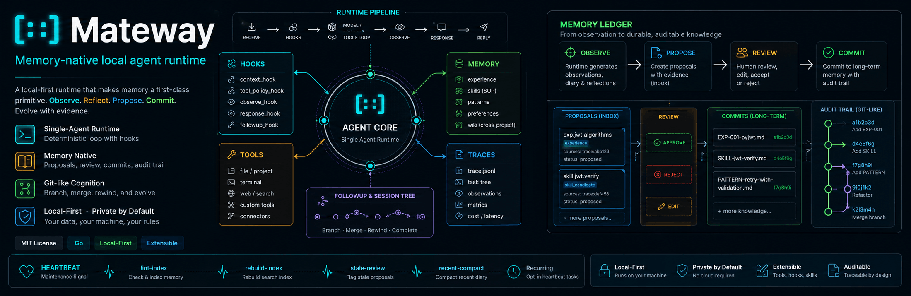

# Mateway

<p align="center">
  
</p>

[English](./README.md) | [中文](./README.zh.md)

**Mateway is a local-first agent runtime kernel for real workspaces and domain applications. It turns a user task into a TaskGraph of verifiable subtasks, runs node-local model/tool/skill execution, and finishes only when the graph evidence satisfies the task or a concrete blocker is known.**

It is intentionally not a heavy workflow platform. The project is about loop engineering: moving from one long global ReAct loop to a graph of recoverable subtask nodes, while keeping tool boundaries, editable skills, white-box memory, and traceable evidence.

```text
message -> Planner -> TaskGraph -> Scheduler
        -> node-local execution -> verifier
        -> finalizer -> memory observe
```

## What Makes It Different

- **TaskGraph planning, not blind chatting.** Planner produces task acceptance and a graph of verifiable subtask nodes.
- **Node-local ReAct.** Complex nodes can run a bounded local ReAct loop, while simple nodes use direct model calls and deterministic work can use scripts/tools.
- **Editable skills.** Skills live as registered local packages with `SKILL.md` and `.mateway/metadata.yaml`. Planner can bind a skill to a node, but tool calls remain node-internal actions/evidence.
- **White-box memory.** Long-term memory is Markdown with YAML frontmatter, plus proposals and audit trails. The agent can suggest durable memory, but the user decides what gets committed.
- **Trace ledger.** Runs produce JSONL traces with model turns, tool calls, evidence, hook events, timing, token diagnostics, and secret redaction.
- **Small local runtime.** CLI, Feishu, Weixin, scheduled jobs, and tests share the same runtime instead of separate agent stacks.

## Current Capabilities

- CLI entrypoints: `mateway ask`, `mateway chat`, and `mateway tui`
- Feishu WebSocket gateway and native Weixin iLink Bot channel
- Built-in tools: `file.read`, `file.write`, `file.edit`, `file.delete`, `terminal.run`, `web.search`, `web.fetch`, `secret.set`, `schedule.manage`, `task.search`, `task.resume`, and `toolresult.read`
- Tool policy with destructive terminal command blocking, path validation, and secret redaction
- TaskGraph runtime foundations: planner, graph state, node execution, verifier, finalizer, and recovery-oriented trace
- Context budgeting, compacted tool output, and raw output retrieval by `raw_ref`
- Multi-agent profile foundations with channel bindings, agent-specific skills, agent-scoped memory, and future local agent node roles
- Memory proposal, lint, search, index rebuild, and learning heartbeat commands

`terminal.run` is the only command execution tool. It can inject secrets through `env_secrets`; traces record only secret ids and environment variable names, never secret values.

## Quick Start

```bash
git clone https://github.com/dragon123960-collab/mateway.git
cd mateway

go test ./...
go build -o build/mateway ./cmd/mateway
./build/mateway init
./build/mateway doctor
```

Then configure local models and channels:

```bash
cp ~/.mateway/config/mateway.env.sample ~/.mateway/config/mateway.env
vim ~/.mateway/config/mateway.env
vim ~/.mateway/config/config.yaml
```

Try the CLI:

```bash
./build/mateway ask "Read README.md and summarize this project."
./build/mateway ask "Inspect the current project directory and identify the runtime entrypoint."
./build/mateway chat
```

`mateway chat` opens the interactive terminal UI when the current terminal supports it, and falls back to the classic line-based REPL with `--classic`. Use `mateway tui` to start the TUI directly.

`mateway init` creates the local home under `~/.mateway/`:

```text
config/      models, channels, runtime settings
workspace/   agent profiles, shared skills, Markdown memory
sessions/    compacted session state
trace/       JSONL runtime traces
observe/     memory and skill learning evidence
indexes/     derived indexes
run/         runtime locks and channel state
```

## Documentation

- [Architecture](./docs/architecture.md) describes package boundaries and the runtime-kernel design.
- [TaskGraph Runtime](./docs/task-graph-runtime.md) describes the final TaskGraph architecture.
- [Execution Flow](./docs/execution-flow.md) follows a task from user message to final answer or blocker.
- [Embedding And App Runtime](./docs/embedding-and-app-runtime.md) explains how applications can use Mateway as a local agent kernel.
- [Configuration](./docs/configuration.md) explains local paths, models, channels, skills, memory, and security settings.
- [Roadmap](./docs/roadmap.md) records the current direction and non-goals.

Development scratch notes live in `dev-notes/` and are intentionally short-lived.

## Design Boundaries

Mateway does not aim to become a distributed workflow platform. Current non-goals:

- No heavy workflow platform or distributed workflow engine.
- No multi-tenant company scheduler.
- No distributed multi-agent supervisor or subagent spawning.
- No gateway business routing layer.
- No command execution tool besides `terminal.run`.

Mateway can support local agent nodes as execution roles, but external schedulers and company-level orchestration should call it as a runtime kernel rather than live inside it.
